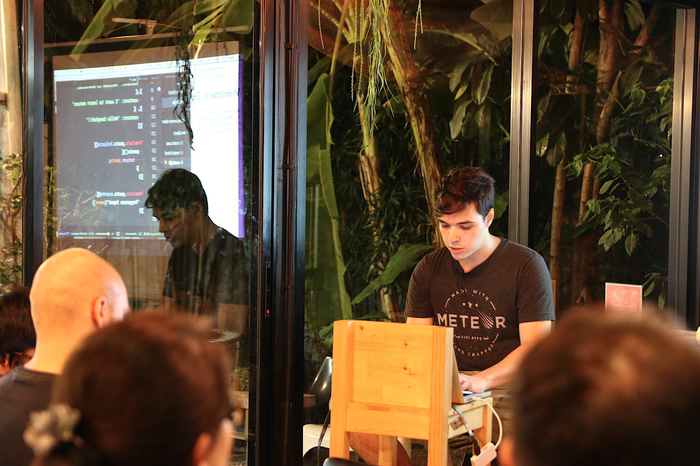

I'm a Software Engineer in living in Bangkok, Thailand. I currently work at [Envisioning](https://envisioning.io) where I work as a Lead Developer. In my free help other developers on, [Codementor](https://www.codementor.io/lnmunhoz), 

I am a full stack developer with 5+ years of experience. I love to create stuff for the web and discover new technologies. I have a strong background with JavaScript, Meteor, MongoDB and React.

I also appreciate helping other developers solving their problems. Everytime a friend or someone that I met in the coworkings or coffeshops ask for help, I try to do my best to help him and we always end up having a nice chat.

Programming in something you become good at it just if you time a good amount of time and effort **consistently**. And people with experience should always be willing to help the ones staring the journey. 

## ✱ Timeline
- **1993:**  
    - Born in São Paulo, Brazil 🇧🇷
- **2012:**
    - Started CS degree at University City of São Paulo
    - Started a intership with VB.NET
- **2013:**
    - Started next intership with C# and ASP.NET MVC
    - Got my first job as a .NET developer
    - Discovered JavaScript
- **2014**
    - Read The 4 Hour Work Week 📖
    - Started work remotely
- **2015:**
    - Started work as a freelancer
    - Graduated 🎓
- **2016:**
    - Joined [Envisioning](http://envisioning.io) and [Toptal](https://www.toptal.com/#utilize-amazing-computer-engineers-now)
    - Worked remotely for companies in Brazil, UK (Coventry) and US (Atlanta)
- **2017:**
    - Traveling through Southeast Asia ✈️ ️
    - Doing lots of [React](https://facebook.github.io/react/) + [Meteor](https://meteor.com) + [GraphQL](http://graphql.org/) 🚀

  

## 🔠 Languages
- Portuguese (native)
- English (fluent)
- Thai (beginner)
- JavaScript (expert)

## 👀 Presentations

- **Mar 2017:** Meteor + React Workshop (english)
- **Jun 2016:** Introduction to MeteorJS (portuguese)
- **May 2014:** MongoDB and KnockoutJS (portuguese)

## 📷 Photos

### Meteor + React Workshop (Bangkok, Thailand)

### Nomad Life (Bangkok, Thailand)

